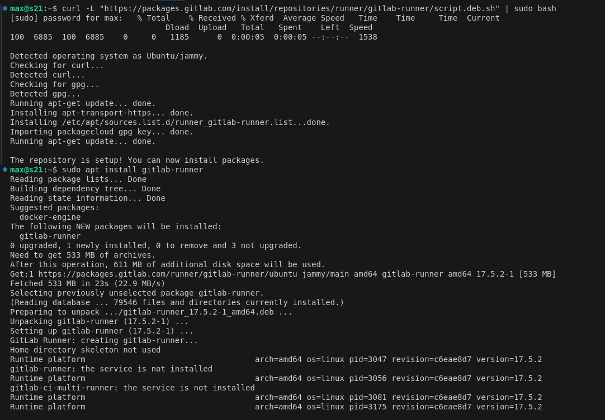
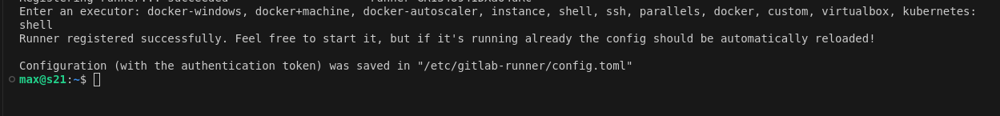
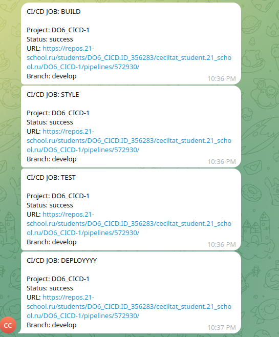

# Basic CI/CD

### Part 1. Настройка **gitlab-runner**


**== Задание ==**

##### Подними виртуальную машину *Ubuntu Server 22.04 LTS*.

##### Скачай и установи на виртуальную машину **gitlab-runner**.

##### Запусти **gitlab-runner** и зарегистрируй его для использования в текущем проекте (*DO6_CICD*).

---

**== Решение ==**
- Устанавливаем gitlub-runner
    
- Регистрируем через sudo gitlab-runner register
    


### Part 2. Сборка

**== Задание ==**

#### Напиши этап для **CI** по сборке приложений из проекта *C2_SimpleBashUtils*.

##### В файле _gitlab-ci.yml_ добавь этап запуска сборки через мейк файл из проекта _C2_.

##### Файлы, полученные после сборки (артефакты), сохрани в произвольную директорию со сроком хранения 30 дней.

---
```
build_job:
  stage: build
  tags:
    - build
  script:
    - rm -rf artifacts
    - mkdir -p artifacts/{cat,grep} 
    - (cd src/cat && make clean && make s21_cat)
    - (cd src/grep && make clean && make s21_grep)
    - cp src/cat/s21_cat artifacts/cat
    - cp src/grep/s21_grep artifacts/grep
  artifacts:
    paths:
      - artifacts
    expire_in: 30 days
```
**== Решение ==**


### Part 3. Тест кодстайла


**== Задание ==**

#### Напиши этап для **CI**, который запускает скрипт кодстайла (*clang-format*).

##### Если кодстайл не прошел, то «зафейли» пайплайн.

##### В пайплайне отобрази вывод утилиты *clang-format*.

---

**== Решение ==**
```
style_job:
  stage: style
  needs:
    - build_job
  tags:
    - style
  script:
    - clang-format -style=Google -n --Werror --verbose src/cat/s21_cat.c
    - clang-format -style=Google -n --Werror --verbose src/grep/s21_grep.c
```

### Part 4. Интеграционные тесты

`-` Отлично, тест на кодстайл написан. [ТИШЕ] Говорю с тобой тет-а-тет. Не говори ничего коллегам. Между нами: ты справляешься очень хорошо. [ГРОМЧЕ] Переходим к написанию интеграционных тестов.

**== Задание ==**

#### Напиши этап для **CI**, который запускает твои интеграционные тесты из того же проекта.

##### Запусти этот этап автоматически только при условии, если сборка и тест кодстайла прошли успешно.

##### Если тесты не прошли, то «зафейли» пайплайн.

##### В пайплайне отобрази вывод, что интеграционные тесты успешно прошли / провалились.

---

**== Решение ==**
```
test_job:
  stage: test
  needs:
    - build_job
    - style_job
  tags:
    - test
  script:
    - cp src/cat/{Makefile,*.txt} artifacts/cat
    - cp src/grep/{Makefile,*.txt} artifacts/grep
    - (cd artifacts/cat && make test)
    - (cd artifacts/grep && make test)
    - rm -f artifacts/cat/*.txt
    - rm -f artifacts/grep/*.txt
  after_script:
    - |
      if [ "$CI_JOB_STATUS" == "success" ]; then
        echo "Tests passed" | tee artifacts/test_status.txt
      else
        echo "Tests failed" | tee artifacts/test_status.txt
      fi
  allow_failure: false
  artifacts:
    paths:
      - artifacts
```

### Part 5. Этап деплоя

`-` Для завершения этого задания ты должен перенести исполняемые файлы на другую виртуальную машину, которая будет играть роль продакшна. Удачи.

**== Задание ==**

##### Подними вторую виртуальную машину *Ubuntu Server 22.04 LTS*.

#### Напиши этап для **CD**, который «разворачивает» проект на другой виртуальной машине.

##### Запусти этот этап вручную при условии, что все предыдущие этапы прошли успешно.

##### Напиши bash-скрипт, который при помощи **ssh** и **scp** копирует файлы, полученные после сборки (артефакты), в директорию */usr/local/bin* второй виртуальной машины.
*Тут тебе могут помочь знания, полученные в проекте DO2_LinuxNetwork.*

- Будь готов объяснить по скрипту, как происходит перенос.

##### В файле _gitlab-ci.yml_ добавь этап запуска написанного скрипта.

##### В случае ошибки «зафейли» пайплайн.

В результате ты должен получить готовые к работе приложения из проекта *C2_SimpleBashUtils* (s21_cat и s21_grep) на второй виртуальной машине.

---
**== Решение ==**

**Добавляем в gitlab-ci.yaml**
```
deploy_job:
  stage: deploy
  needs:
    - build_job
    - style_job
    - test_job
  tags:
    - deploy
  script:
    - echo "Deploying..."
    - chmod +x src/copy.sh
    - src/copy.sh
  allow_failure: false
  when: manual

```

**Делаем скрипт, который переносит артефакты с одной виртуальной машины на другую**
***copy\.sh***
```
#!/bin/bash

# Берем переменные
source /home/gitlab-runner/.env

# Копирование файлов
scp ${REPO_PATH}artifacts/cat/s21_cat ${REMOTE_USER}@${REMOTE_HOST}:${REMOTE_PATH}/s21_cat
scp ${REPO_PATH}artifacts/grep/s21_grep ${REMOTE_USER}@${REMOTE_HOST}:${REMOTE_PATH}/s21_grep

# Проверка успешности копирования
if ssh ${REMOTE_USER}@${REMOTE_HOST} "[ -f ${REMOTE_PATH}/s21_cat ] && [ -f ${REMOTE_PATH}/s21_grep ]"; then
  echo "Deployment successful"
  echo ""
  echo "Files on the second machine:"
  ssh ${REMOTE_USER}@${REMOTE_HOST} ls -la /usr/local/bin
  exit 0
else
  echo "Deployment failed"
  exit 1
fi

```

### Part 6. Дополнительно. Уведомления

`-` Здесь написано, что твое следующее задание выполняется специально для нобелевских лауреатов. Здесь не сказано, за что они получили премию, но точно не за умение работать с **gitlab-runner**.

**== Задание ==**

##### Настрой уведомления об успешном/неуспешном выполнении пайплайна через бота с именем «[твой nickname] DO6 CI/CD» в *Telegram*.

- Текст уведомления должен содержать информацию об успешности прохождения как этапа **CI**, так и этапа **CD**.
- В остальном текст уведомления может быть произвольным.

---

**== Решение ==**
***Итоговый gitlab-ci.yaml***
```
stages:
  - build
  - style
  - test
  - deploy

build_job:
  stage: build
  tags:
    - build
  script:
    - rm -rf artifacts
    - mkdir -p artifacts/{cat,grep} 
    - (cd src/cat && make clean && make s21_cat)
    - (cd src/grep && make clean && make s21_grep)
    - cp src/cat/s21_cat artifacts/cat
    - cp src/grep/s21_grep artifacts/grep
  artifacts:
    paths:
      - artifacts
    expire_in: 30 days
  after_script:
    - chmod +x src/tg_notify.sh
    - src/tg_notify.sh "BUILD"

style_job:
  stage: style
  needs:
    - build_job
  tags:
    - style
  script:
    - clang-format -style=Google -n --Werror --verbose src/cat/s21_cat.c
    - clang-format -style=Google -n --Werror --verbose src/grep/s21_grep.c
  after_script:
    - chmod +x src/tg_notify.sh
    - src/tg_notify.sh "STYLE"

test_job:
  stage: test
  needs:
    - build_job
    - style_job
  tags:
    - test
  script:
    - cp src/cat/{Makefile,*.txt} artifacts/cat
    - cp src/grep/{Makefile,*.txt} artifacts/grep
    - (cd artifacts/cat && make test)
    - (cd artifacts/grep && make test)
    - rm -f artifacts/cat/*.txt
    - rm -f artifacts/grep/*.txt
  after_script:
    - |
      if [ "$CI_JOB_STATUS" == "success" ]; then
        echo "Tests passed" | tee artifacts/test_status.txt
      else
        echo "Tests failed" | tee artifacts/test_status.txt
      fi
    - chmod +x src/tg_notify.sh
    - src/tg_notify.sh "TEST"
  allow_failure: false
  artifacts:
    paths:
      - artifacts

deploy_job:
  stage: deploy
  needs:
    - build_job
    - style_job
    - test_job
  tags:
    - deploy
  script:
    - echo "Deploying..."
    - chmod +x src/copy.sh
    - src/copy.sh
  after_script:
    - chmod +x src/tg_notify.sh
    - src/tg_notify.sh "DEPLOYYYY"
  allow_failure: false
  when: manual
  
```

***Скрипт, отправляющий сообщения в tg***
***tg_notify.sh***
```
#!/bin/bash

source /home/gitlab-runner/.env

URL="https://api.telegram.org/bot$TELEGRAM_BOT_TOKEN/sendMessage"
TEXT="CI/CD JOB: $1%0A%0AProject:+$CI_PROJECT_NAME%0AStatus:+$CI_JOB_STATUS%0AURL:+$CI_PROJECT_URL/pipelines/$CI_PIPELINE_ID/%0ABranch:+$CI_COMMIT_REF_SLUG"

curl -s --max-time 10 -d "chat_id=$TELEGRAM_USER_ID&disable_web_page_preview=1&text=$TEXT" $URL > /dev/null
```

***Результат его работы***
