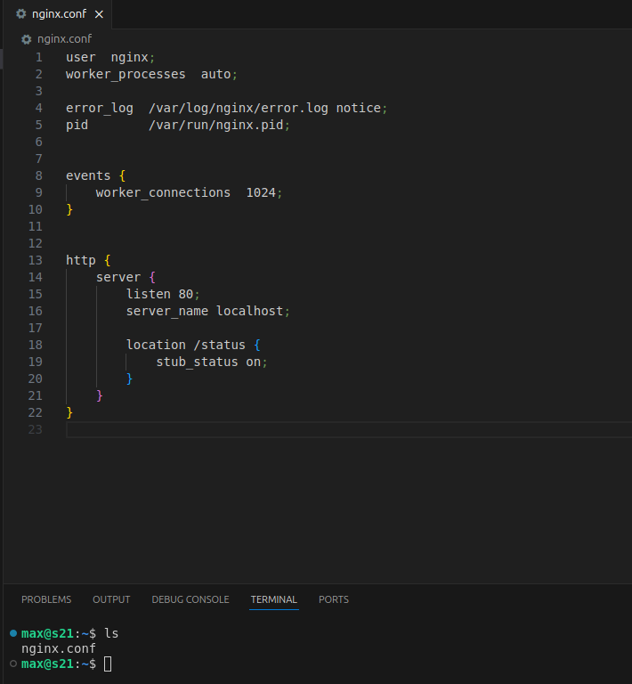
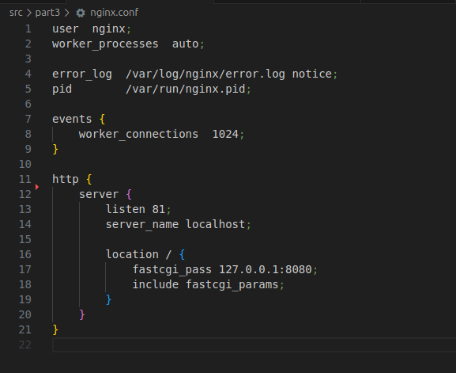
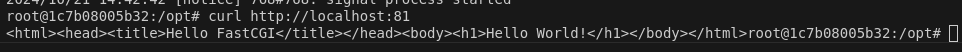

# Simple Docker

## Part 1. Готовый докер

**== Задание ==**

##### Возьми официальный докер-образ с **nginx** и выкачай его при помощи `docker pull`.
##### Проверь наличие докер-образа через `docker images`.
##### Запусти докер-образ через `docker run -d [image_id|repository]`.
##### Проверь, что образ запустился через `docker ps`.
##### Посмотри информацию о контейнере через `docker inspect [container_id|container_name]`.
##### По выводу команды определи и помести в отчёт размер контейнера, список замапленных портов и ip контейнера.
##### Останови докер контейнер через `docker stop [container_id|container_name]`.
##### Проверь, что контейнер остановился через `docker ps`.
##### Запусти докер с портами 80 и 443 в контейнере, замапленными на такие же порты на локальной машине, через команду *run*.
##### Проверь, что в браузере по адресу *localhost:80* доступна стартовая страница **nginx**.
##### Перезапусти докер контейнер через `docker restart [container_id|container_name]`.
##### Проверь любым способом, что контейнер запустился.

- В отчёт помести скрины:
  - вызова и вывода всех использованных в этой части задания команд;
  - стартовой страницы **nginx** по адресу *localhost:80* (адрес должен быть виден).
  

___
**== Решение ==**
- Установка образа
  - 
- Проверка наличия докер-образа
  - 
- Запуск докер-образа, проверка, что докер образ запущен
  - 
- Проверка информации о контейнере
  - 
  - Размер контейнера удалось узнать только через docker ps -s  
    
  - Cписок замапленных портов
    
  - IP контейнера
    
- Остановка контейнера
  - 
  - 
- Запуcк докер с портами 80 и 443 в контейнере, замапленными на такие же порты на локальной машине
  - 
- Проверка, что по localhost:80 отображается стартовая страница nginx
  - 
- Рестарт контейнера
  - Рестарт
    
  - Проверка, что перезапуск произошел успешно
  


## Part 2. Операции с контейнером

Докер-образ и контейнер готовы. Теперь можно покопаться в конфигурации **nginx** и отобразить статус страницы.

**== Задание ==**

##### Прочитай конфигурационный файл *nginx.conf* внутри докер контейнера через команду *exec*.
##### Создай на локальной машине файл *nginx.conf*.
##### Настрой в нем по пути */status* отдачу страницы статуса сервера **nginx**.
##### Скопируй созданный файл *nginx.conf* внутрь докер-образа через команду `docker cp`.
##### Перезапусти **nginx** внутри докер-образа через команду *exec*.
##### Проверь, что по адресу *localhost:80/status* отдается страничка со статусом сервера **nginx**.
##### Экспортируй контейнер в файл *container.tar* через команду *export*.
##### Останови контейнер.
##### Удали образ через `docker rmi [image_id|repository]`, не удаляя перед этим контейнеры.
##### Удали остановленный контейнер.
##### Импортируй контейнер обратно через команду *import*.
##### Запусти импортированный контейнер.
##### Проверь, что по адресу *localhost:80/status* отдается страничка со статусом сервера **nginx**.

- В отчёт помести скрины:
  - вызова и вывода всех использованных в этой части задания команд;
  - содержимое созданного файла *nginx.conf*;
  - страницы со статусом сервера **nginx** по адресу *localhost:80/status*.
---
**== Решение ==**
- Читаем конфигурационный файл *nginx.conf* внутри докер контейнера через команду *exec*
  - 
- Создаем nginx.conf на машине вне контейнера, настраиваем путь /status
  - 
- Копируем с заменой этот конфиг в докер-контейнер, перезапускаем nginx
  - 
- Проверяем, что по адресу localhost:80/status отдается страничка со статусом сервера nginx
  - (опечатка небольшая)
- Экспортируем контейнер в файл container.tar через команду export
  - 
- Останавливаем контейнер
  - 
- Удаляем образ, не удаляя контейнер
  - 
- Удаляем контейнер
  - 
- Импортируем образ
  - 
- Запускаем контейнер
  - 
- Проверяем ответ по адресу localhost:80/status
  - 

## Part 3. Мини веб-сервер

**== Задание ==**

##### Напиши мини-сервер на **C** и **FastCgi**, который будет возвращать простейшую страничку с надписью `Hello World!`.
##### Запусти написанный мини-сервер через *spawn-fcgi* на порту 8080.
##### Напиши свой *nginx.conf*, который будет проксировать все запросы с 81 порта на *127.0.0.1:8080*.
##### Проверь, что в браузере по *localhost:81* отдается написанная тобой страничка.
##### Положи файл *nginx.conf* по пути *./nginx/nginx.conf* (это понадобится позже).
---
**== Решение ==**

- nginx.conf  
    
- Мини-сервер на C и FastCgi  
    
- Копируем файлы выше в контейнер с необходимыми  зависимостями  
    
- Компилируем мини-сервер  
    
- Проверяем работу  
    

## Part 4. Свой докер

Теперь всё готово. Можно приступать к написанию докер-образа для созданного сервера.

**== Задание ==**

*При написании докер-образа избегай множественных вызовов команд RUN*

#### Напиши свой докер-образ, который:
##### 1) собирает исходники мини сервера на FastCgi из [Части 3](#part-3-мини-веб-сервер);
##### 2) запускает его на 8080 порту;
##### 3) копирует внутрь образа написанный *./nginx/nginx.conf*;
##### 4) запускает **nginx**.
_**nginx** можно установить внутрь докера самостоятельно, а можно воспользоваться готовым образом с **nginx**'ом, как базовым._

##### Собери написанный докер-образ через `docker build` при этом указав имя и тег.
##### Проверь через `docker images`, что все собралось корректно.
##### Запусти собранный докер-образ с маппингом 81 порта на 80 на локальной машине и маппингом папки *./nginx* внутрь контейнера по адресу, где лежат конфигурационные файлы **nginx**'а (см. [Часть 2](#part-2-операции-с-контейнером)).
##### Проверь, что по localhost:80 доступна страничка написанного мини сервера.
##### Допиши в *./nginx/nginx.conf* проксирование странички */status*, по которой надо отдавать статус сервера **nginx**.
##### Перезапусти докер-образ.
*Если всё сделано верно, то, после сохранения файла и перезапуска контейнера, конфигурационный файл внутри докер-образа должен обновиться самостоятельно без лишних действий*.
##### Проверь, что теперь по *localhost:80/status* отдается страничка со статусом **nginx**
---
**== Решение ==**
### Dockerfile
```
FROM ubuntu:latest

WORKDIR /opt

COPY fastcgi_server.c /opt

RUN apt update -y && \
    apt install -y nginx gcc libfcgi-dev spawn-fcgi && \
    gcc -o fastcgi_server fastcgi_server.c -lfcgi && \
    useradd -r -s /bin/false nginx

COPY nginx.conf /etc/nginx


CMD ["sh", "-c", "spawn-fcgi -p 8080 /opt/fastcgi_server && nginx -g 'daemon off;'"]

```

- Билдим образ
  
- Запускаем контейнер
  
- Проверяем, что контейнер есть в процессах и смотрим страницу по localhost:80
  
- Добавляем в nginx.conf ```        location /status {
            stub_status on;
        }``` через замапленную папку nginx
- Перезагружаем nginx и смотрим какой ответ получим по localhost:80/status
  

## Part 5. **Dockle**

После написания образа никогда не будет лишним проверить его на безопасность.
**== Задание ==**

##### Просканируй образ из предыдущего задания через `dockle [image_id|repository]`.
##### Исправь образ так, чтобы при проверке через **dockle** не было ошибок и предупреждений.
---
**== Решение ==**
- Ошибки, которые нашел dockle
    

### Измененный Dockerfile
```
FROM ubuntu:latest

USER root

# Install dependencies and clean up
RUN apt update -y && \
    apt install -y nginx gcc libfcgi-dev spawn-fcgi && \
    rm -rf /var/lib/apt/lists/* && \
    mkdir /app 

# Copy configuration files
COPY nginx.conf /etc/nginx
COPY fastcgi_server.c /app

# Set permissions
RUN groupadd -r nginx && useradd -r -g nginx nginx && \
    mkdir -p /var/lib/nginx && \
    mkdir -p /var/log/nginx && \
    mkdir -p /var/run/nginx && \
    chown -R nginx:nginx /var/lib/nginx && \
    chown -R nginx:nginx /var/log/nginx && \
    chown -R nginx:nginx /app && \
    chown -R nginx:nginx /etc/nginx && \
    chown -R nginx:nginx /var/run/nginx && \

USER nginx

# Compile the FastCGI server
RUN gcc -o /app/fastcgi_server /app/fastcgi_server.c -lfcgi

HEALTHCHECK --interval=5m --timeout=10s CMD curl -f http://localhost:80 || exit 1

# Run the FastCGI server and nginx
CMD ["sh", "-c", "spawn-fcgi -p 8080 /app/fastcgi_server && nginx -g 'daemon off;'"]
```

## Part 6. Базовый **Docker Compose**


**== Задание ==**

##### Напиши файл *docker-compose.yml*, с помощью которого:
##### 1) Подними докер-контейнер из [Части 5](#part-5-инструмент-dockle) _(он должен работать в локальной сети, т. е. не нужно использовать инструкцию **EXPOSE** и мапить порты на локальную машину)_.
##### 2) Подними докер-контейнер с **nginx**, который будет проксировать все запросы с 8080 порта на 81 порт первого контейнера.
##### Замапь 8080 порт второго контейнера на 80 порт локальной машины.

##### Останови все запущенные контейнеры.
##### Собери и запусти проект с помощью команд `docker-compose build` и `docker-compose up`.
##### Проверь, что в браузере по *localhost:80* отдается написанная тобой страничка, как и ранее.

---

**== Решение ==**
### docker-compose.yml
```
services:
  fastcgi-server:
    build:
      context: .
      dockerfile: Dockerfile
    container_name: fastcgi-server
    networks:
      - app-net

  nginx-proxy:
    image: nginx:latest
    container_name: nginx-proxy
    networks:
      - app-net
    ports:
      - "80:8080"
    volumes:
      - ./nginx_proxy_container/:/etc/nginx

networks:
  app-net:
    driver: bridge
```
### nginx.conf внутри первого контейнера
```
worker_processes  auto;

error_log  /var/log/nginx/error.log notice;
pid        /var/run/nginx/nginx.pid;

events {
    worker_connections  1024;
}

http {
    server {
        listen 81;
        server_name localhost;

        location / {
            fastcgi_pass 127.0.0.1:8080;
            include fastcgi_params;
        }
    }
}
```

### nginx.conf внутри второго контейнера (прокси)
```

worker_processes  auto;

error_log  /var/log/nginx/error.log notice;
pid        /var/run/nginx.pid;

events {
    worker_connections  1024;
}

http {
    server {
        listen 8080;

        location / {
            proxy_pass http://fastcgi-server:81;
        }
    }
}

```

- Билдим и запускаем проект с помощью docker-compose. Проверяем localhost:80
  
