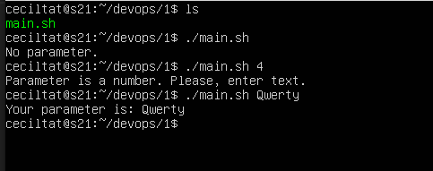
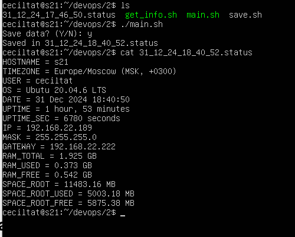
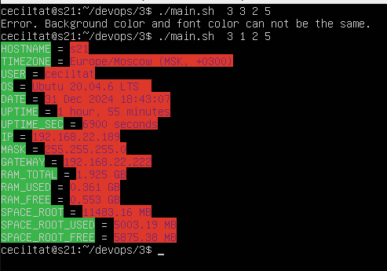
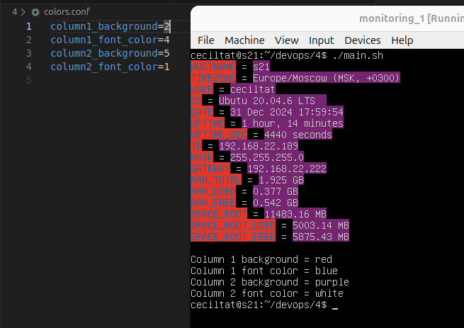
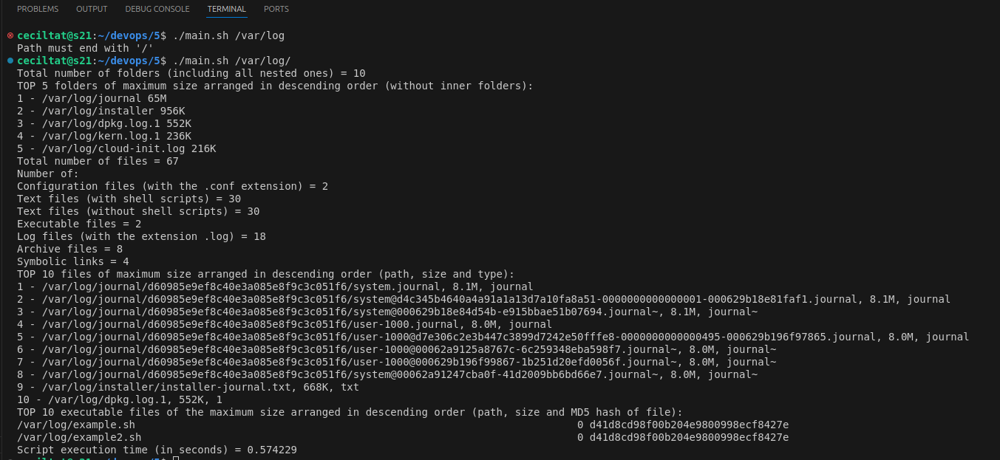

# Linux Monitoring v1.0


## Part 1. Проба пера

**== Задание ==**

Напиши bash-скрипт. Скрипт запускается с одним параметром. Параметр текстовый.  
Скрипт выводит значение параметра.  
Если параметр — число, то должно выводиться сообщение о некорректности ввода.

---

**== Решение ==**
- main\.sh
  ```bash
  #!/bin/bash

  if [ -z "$1"  ]; then
    echo "No parameter."
    exit 1	
  fi

  REGEX="^[0-9]+$"

  if [[ "$1" =~ $REGEX ]]; then
    echo "Parameter is a number. Please, enter text."
    exit 1
  fi

  echo "Your parameter is: $1"
  ```
   
- Вывод  
  

## Part 2. Исследование системы

**== Задание ==**

Напиши bash-скрипт. Скрипт должен вывести на экран информацию в виде:

**HOSTNAME** = _сетевое имя_  
**TIMEZONE** = _временная зона в виде: **America/New_York UTC -5** (временная зона, должна браться из системы и быть корректной для текущего местоположения)_  
**USER** = _текущий пользователь, который запустил скрипт_  
**OS** = _тип и версия операционной системы_  
**DATE** = _текущее время в виде: **12 May 2020 12:24:36**_  
**UPTIME** = _время работы системы_  
**UPTIME_SEC** = _время работы системы в секундах_  
**IP** = _ip-адрес машины в любом из сетевых интерфейсов_  
**MASK** = _сетевая маска любого из сетевых интерфейсов в виде: **xxx.xxx.xxx.xxx**_  
**GATEWAY** = _ip шлюза по умолчанию_  
**RAM_TOTAL** = _размер оперативной памяти в Гб c точностью три знака после запятой в виде: **3.125 GB**_  
**RAM_USED** = _размер используемой памяти в Гб c точностью три знака после запятой_  
**RAM_FREE** = _размер свободной памяти в Гб c точностью три знака после запятой_  
**SPACE_ROOT** = _размер рутового раздела в Mб с точностью два знака после запятой в виде: **254.25 MB**_  
**SPACE_ROOT_USED** = _размер занятого пространства рутового раздела в Mб с точностью два знака после запятой_  
**SPACE_ROOT_FREE** = _размер свободного пространства рутового раздела в Mб с точностью два знака после запятой_

После вывода значений предложи записать данные в файл (предложить пользователю ответить **Y/N**).  
Ответы **Y** и **y** считаются положительными, все прочие — отрицательными.
При согласии пользователя в текущей директории пусть создается файл, содержащий информацию, которая была выведена на экран.  
Название файла должно иметь вид: **DD_MM_YY_HH_MM_SS.status** (Время в имени файла должно указывать момент сохранения данных).

---

**== Решение ==**
- main\.sh
  ```bash
  #!/bin/bash 

  # Getting system info
  source get_info.sh

  # Saving information in the file
  source save.sh
  ```

- get_info\.sh
  ```bash
  #!/bin/bash

  HOSTNAME=$(hostname)
  TIMEZONE=$(timedatectl | awk '/Time zone/ {print $3, $4, $5}')
  USER=$(whoami)
  OS=$(cat /etc/issue | tr -d '\\n\\l')
  DATE=$(date +"%d %b %Y %T")
  UPTIME=$(uptime -p | cut -d' ' -f2-)
  UPTIME_SEC=$(uptime -p | awk '{print ($2*3600)+($4*60)}')
  IP_AND_MASK=$(ip -4 a s enp0s3 | awk '/inet/ {print $2}')
  IP=${IP_AND_MASK%%/*}
  MASK=$(ipcalc -n 0.0.0.0/${IP_AND_MASK##*/} | awk '/Netmask/ {print $2}')
  GATEWAY=$(ip r | awk '/default/ {print $3}')
  RAM_TOTAL=$(free -m | awk '/Mem:/ {printf "%.3f GB", $2/1024}')
  RAM_USED=$(free -m | awk '/Mem:/ {printf "%.3f GB", $3/1024}')
  RAM_FREE=$(free -m | awk '/Mem:/ {printf "%.3f GB", $4/1024}')
  SPACE_ROOT=$(df / | awk 'NR==2 {printf "%.2f MB", $2/1024}')
  SPACE_ROOT_USED=$(df / | awk 'NR==2 {printf "%.2f MB", $3/1024}')
  SPACE_ROOT_FREE=$(df / | awk 'NR==2 {printf "%.2f MB", $4/1024}')
  ```

- save_info\.sh
 ```bash
  #!/bin/bash
  read -p "Save data? (Y/N): " ANSWER

  if [[ "$ANSWER" =~ ^[Yy]$ ]]; then
    FILENAME=$(date +"%d_%m_%y_%H_%M_%S").status
    {
      echo "HOSTNAME = $HOSTNAME"
      echo "TIMEZONE = $TIMEZONE"
      echo "USER = $USER"
      echo "OS = $OS"
      echo "DATE = $DATE"
      echo "UPTIME = $UPTIME"
      echo "UPTIME_SEC = $UPTIME_SEC seconds"
      echo "IP = $IP"
      echo "MASK = $MASK"
      echo "GATEWAY = $GATEWAY"
      echo "RAM_TOTAL = $RAM_TOTAL"
      echo "RAM_USED = $RAM_USED"
      echo "RAM_FREE = $RAM_FREE"
      echo "SPACE_ROOT = $SPACE_ROOT"
      echo "SPACE_ROOT_USED = $SPACE_ROOT_USED"
      echo "SPACE_ROOT_FREE = $SPACE_ROOT_FREE"
    } > "$FILENAME"
    echo "Saved in $FILENAME"
  else
    echo "Data was not saved."
  fi
  ```
- Вывод  
  


## Part 3. Визуальное оформление вывода для скрипта исследования системы

Всё готово! Но как же скучно оно выглядит... Нужно добавить больше красок в этот мир!

**== Задание ==**

Напиши bash-скрипт. За основу возьми скрипт из [**Part 2**](#part-2-исследование-системы) и убери из него часть, ответственную за сохранение данных в файл.
Скрипт запускается с 4 параметрами. Параметры числовые. От 1 до 6, например:  
`script03.sh 1 3 4 5`

Обозначения цветов: (1 — white, 2 — red, 3 — green, 4 — blue, 5 – purple, 6 — black)  
**Параметр 1** — это фон названий значений (HOSTNAME, TIMEZONE, USER и т. д.).  
**Параметр 2** — это цвет шрифта названий значений (HOSTNAME, TIMEZONE, USER и т. д.).  
**Параметр 3** — это фон значений (после знака '=').  
**Параметр 4** — это цвет шрифта значений (после знака '=').

Цвета шрифта и фона одного столбца не должны совпадать.  
При вводе совпадающих значений должно выводиться сообщение, описывающее проблему, и предложение повторно вызвать скрипт.  
После вывода сообщения программа должна корректно завершиться.

**== Решение ==**

- main\.sh
  ```bash
  #!/bin/bash 

  # Getting system info
  source get_info.sh

  # Make pretty output
  source make_pretty.sh
  ```

- get_info\.sh
  ```bash
  #!/bin/bash

  HOSTNAME=$(hostname)
  TIMEZONE=$(timedatectl | awk '/Time zone/ {print $3, $4, $5}')
  USER=$(whoami)
  OS=$(cat /etc/issue | tr -d '\\n\\l')
  DATE=$(date +"%d %b %Y %T")
  UPTIME=$(uptime -p | cut -d' ' -f2-)
  UPTIME_SEC=$(uptime -p | awk '{print ($2*3600)+($4*60)}')
  IP_AND_MASK=$(ip -4 a s enp0s3 | awk '/inet/ {print $2}')
  IP=${IP_AND_MASK%%/*}
  MASK=$(ipcalc -n 0.0.0.0/${IP_AND_MASK##*/} | awk '/Netmask/ {print $2}')
  GATEWAY=$(ip r | awk '/default/ {print $3}')
  RAM_TOTAL=$(free -m | awk '/Mem:/ {printf "%.3f GB", $2/1024}')
  RAM_USED=$(free -m | awk '/Mem:/ {printf "%.3f GB", $3/1024}')
  RAM_FREE=$(free -m | awk '/Mem:/ {printf "%.3f GB", $4/1024}')
  SPACE_ROOT=$(df / | awk 'NR==2 {printf "%.2f MB", $2/1024}')
  SPACE_ROOT_USED=$(df / | awk 'NR==2 {printf "%.2f MB", $3/1024}')
  SPACE_ROOT_FREE=$(df / | awk 'NR==2 {printf "%.2f MB", $4/1024}')
  ```

- make_pretty\.sh
  ```bash
  #!/bin/bash

  if [ $# -ne 4 ]; then
      echo "Error. Must be 4 parameters."
      exit 1
  fi

  NAME_BACKGROUND=$1
  NAME_FONT=$2
  VALUE_BACKGROUND=$3
  VALUE_FONT=$4

  BG_COLORS=(
      "\033[47m"  # white
      "\033[41m"  # red
      "\033[42m"  # green
      "\033[44m"  # blue
      "\033[45m"  # purple
      "\033[40m"  # black
  )

  FONT_COLORS=(
      "\e[37m"  # white
      "\e[31m"  # red
      "\e[32m"  # green
      "\e[34m"  # blue
      "\e[35m"  # purple
      "\e[30m"  # black
  )

  RE="^[1-6]$"
  if ! [[ "$NAME_BACKGROUND" =~ $RE ]] || ! [[ "$NAME_FONT" =~ $RE ]] || ! [[ "$VALUE_BACKGROUND" =~ $RE ]] || ! [[ "$VALUE_FONT" =~ $RE ]]; then
      echo "Error. Values must be integers between 1 and 6 included."
      exit 1
  fi

  if [ "$NAME_BACKGROUND" -eq "$NAME_FONT" ] || [ "$VALUE_BACKGROUND" -eq "$VALUE_FONT" ]; then
      echo "Error. Background color and font color can not be the same."
      exit 1
  fi

  NAME_BACKGROUND=$(( NAME_BACKGROUND - 1 ))
  NAME_FONT=$(( NAME_FONT - 1 ))
  VALUE_BACKGROUND=$(( VALUE_BACKGROUND - 1 ))
  VALUE_FONT=$(( VALUE_FONT - 1 ))

  print_line() {
      local name="$1"
      local value="$2"
      
      local NAME_COLOR="${BG_COLORS[$NAME_BACKGROUND]}${FONT_COLORS[$NAME_FONT]}"
      local VALUE_COLOR="${BG_COLORS[$VALUE_BACKGROUND]}${FONT_COLORS[$VALUE_FONT]}"
      local COLOR_RESET="\033[0m"

      echo -e "${NAME_COLOR}$name${COLOR_RESET} = ${VALUE_COLOR}$value${COLOR_RESET}"
  }

  print_line "HOSTNAME" "$HOSTNAME"
  print_line "TIMEZONE" "$TIMEZONE"
  print_line "USER" "$USER"
  print_line "OS" "$OS"
  print_line "DATE" "$DATE"
  print_line "UPTIME" "$UPTIME"
  print_line "UPTIME_SEC" "$UPTIME_SEC seconds"
  print_line "IP" "$IP"
  print_line "MASK" "$MASK"
  print_line "GATEWAY" "$GATEWAY"
  print_line "RAM_TOTAL" "$RAM_TOTAL"
  print_line "RAM_USED" "$RAM_USED"
  print_line "RAM_FREE" "$RAM_FREE"
  print_line "SPACE_ROOT" "$SPACE_ROOT"
  print_line "SPACE_ROOT_USED" "$SPACE_ROOT_USED"
  print_line "SPACE_ROOT_FREE" "$SPACE_ROOT_FREE"
  ```

- Вывод  
  


## Part 4. Конфигурирование визуального оформления вывода для скрипта исследования системы

Вот теперь всё красиво! Но как же не хочется каждый раз вбивать цвета как параметры... Надо придумать что-нибудь более удобное.

**== Задание ==**

Напиши bash-скрипт. За основу возьми скрипт из [**Part 3**](#part-3-визуальное-оформление-вывода-для-скрипта-исследования-системы). Обозначения цветов аналогичные.  
Скрипт запускается без параметров. Параметры задаются в конфигурационном файле до запуска скрипта.  
Конфигурационный файл должен иметь вид:
```
column1_background=2
column1_font_color=4
column2_background=5
column2_font_color=1
```

Если один или несколько параметров не заданы в конфигурационном файле, то цвет должен подставляться из цветовой схемы, заданной по умолчанию. (Выбор на усмотрение разработчика).

После вывода информации о системе из [**Part 3**](#part-3-визуальное-оформление-вывода-для-скрипта-исследования-системы), нужно, сделав отступ в одну пустую строку, вывести цветовую схему в следующем виде:
```
Column 1 background = 2 (red)
Column 1 font color = 4 (blue)
Column 2 background = 5 (purple)
Column 2 font color = 1 (white)
```

При запуске скрипта с цветовой схемой по умолчанию вывод должен иметь вид:
```
Column 1 background = default (black)
Column 1 font color = default (white)
Column 2 background = default (red)
Column 2 font color = default (blue)
```

**== Решение ==**

- Измененный make_pretty.sh
```bash
#!/bin/bash

if [[ ! -f ./colors.conf ]]; then
    echo "Error: Config file does not exist"
    exit 1
fi

BG_COLORS=(
    "\033[47m"  # white
    "\033[41m"  # red
    "\033[42m"  # green
    "\033[44m"  # blue
    "\033[45m"  # purple
    "\033[40m"  # black
)

FONT_COLORS=(
    "\e[37m"  # white
    "\e[31m"  # red
    "\e[32m"  # green
    "\e[34m"  # blue
    "\e[35m"  # purple
    "\e[30m"  # black
)

COLOR_NAMES=("white" "red" "green" "blue" "purple" "black")

column1_background=$(grep "column1_background" colors.conf | cut -d "=" -f 2 | tr -d '[:space:]')
if [[ -z "$column1_background" ]]; then
    column1_background=6  # Default to black
    column1_background_name="default (black)"
else
    column1_background_name="${COLOR_NAMES[$((column1_background - 1))]}"
fi

column1_font_color=$(grep "column1_font_color" colors.conf | cut -d "=" -f 2 | tr -d '[:space:]')
if [[ -z "$column1_font_color" ]]; then
    column1_font_color=1  # Default to white
    column1_font_color_name="default (white)"
else
    column1_font_color_name="${COLOR_NAMES[$((column1_font_color - 1))]}"
fi

column2_background=$(grep "column2_background" colors.conf | cut -d "=" -f 2 | tr -d '[:space:]')
if [[ -z "$column2_background" ]]; then
    column2_background=2  # Default to red
    column2_background_name="default (red)"
else
    column2_background_name="${COLOR_NAMES[$((column2_background - 1))]}"
fi

column2_font_color=$(grep "column2_font_color" colors.conf | cut -d "=" -f 2 | tr -d '[:space:]')
if [[ -z "$column2_font_color" ]]; then
    column2_font_color=4  # Default to blue
    column2_font_color_name="default (blue)"
else
    column2_font_color_name="${COLOR_NAMES[$((column2_font_color - 1))]}"
fi

# Convert to indices
column1_background=$((column1_background - 1))
column1_font_color=$((column1_font_color - 1))
column2_background=$((column2_background - 1))
column2_font_color=$((column2_font_color - 1))

if [[ "$column1_background" -eq "$column1_font_color" || "$column2_background" -eq "$column2_font_color" ]]; then
    echo "Error: Background color and font color cannot be the same."
    exit 1
fi

print_line() {
    local name="$1"
    local value="$2"

    local NAME_COLOR="${BG_COLORS[$column1_background]}${FONT_COLORS[$column1_font_color]}"
    local VALUE_COLOR="${BG_COLORS[$column2_background]}${FONT_COLORS[$column2_font_color]}"
    local COLOR_RESET="\033[0m"

    echo -e "${NAME_COLOR}$name${COLOR_RESET} = ${VALUE_COLOR}$value${COLOR_RESET}"
}

print_line "HOSTNAME" "$HOSTNAME"
print_line "TIMEZONE" "$TIMEZONE"
print_line "USER" "$USER"
print_line "OS" "$OS"
print_line "DATE" "$DATE"
print_line "UPTIME" "$UPTIME"
print_line "UPTIME_SEC" "$UPTIME_SEC seconds"
print_line "IP" "$IP"
print_line "MASK" "$MASK"
print_line "GATEWAY" "$GATEWAY"
print_line "RAM_TOTAL" "$RAM_TOTAL"
print_line "RAM_USED" "$RAM_USED"
print_line "RAM_FREE" "$RAM_FREE"
print_line "SPACE_ROOT" "$SPACE_ROOT"
print_line "SPACE_ROOT_USED" "$SPACE_ROOT_USED"
print_line "SPACE_ROOT_FREE" "$SPACE_ROOT_FREE"

echo

echo "Column 1 background = $column1_background_name"
echo "Column 1 font color = $column1_font_color_name"
echo "Column 2 background = $column2_background_name"
echo "Column 2 font color = $column2_font_color_name"
```

- Вывод с разными конфигами  
    
  

## Part 5. Исследование файловой системы

Теперь, когда вывод информации о системе готов, красив и удобен, можно приступать ко второй части плана.

**== Задание ==**

Напиши bash-скрипт. Скрипт запускается с одним параметром.  
Параметр — это абсолютный или относительный путь до какой-либо директории. Параметр должен заканчиваться знаком '/', например:  
`script05.sh /var/log/`

Скрипт должен выводить следующую информацию о каталоге, указанном в параметре:
- Общее число папок, включая вложенные;
- Топ-5 папок с самым большим весом в порядке убывания (путь и размер);
- Общее число файлов;
- Число конфигурационных файлов (с расширением .conf), текстовых файлов, исполняемых файлов, логов (файлов с расширением .log), архивов, символических ссылок;
- Топ-10 файлов с самым большим весом в порядке убывания (путь, размер и тип);
- Топ-10 исполняемых файлов с самым большим весом в порядке убывания (путь, размер и хеш);
- Время выполнения скрипта.

Скрипт должен вывести на экран информацию в виде:

```
Total number of folders (including all nested ones) = 6  
TOP 5 folders of maximum size arranged in descending order (path and size):  
1 - /var/log/one/, 100 GB  
2 - /var/log/two/, 100 MB  
etc up to 5
Total number of files = 30
Number of:  
Configuration files (with the .conf extension) = 1 
Text files = 10  
Executable files = 5
Log files (with the extension .log) = 2  
Archive files = 3  
Symbolic links = 4  
TOP 10 files of maximum size arranged in descending order (path, size and type):  
1 - /var/log/one/one.exe, 10 GB, exe  
2 - /var/log/two/two.log, 10 MB, log  
etc up to 10  
TOP 10 executable files of the maximum size arranged in descending order (path, size and MD5 hash of file):  
1 - /var/log/one/one.exe, 10 GB, 3abb17b66815bc7946cefe727737d295  
2 - /var/log/two/two.exe, 9 MB, 53c8fdfcbb60cf8e1a1ee90601cc8fe2  
etc up to 10  
Script execution time (in seconds) = 1.5
```

**== Решение ==**

- main\.sh  
  ```bash
  #!/bin/bash

  source validation.sh

  source get_info.sh

  source output.sh
  ```

- validation\.sh
  ```bash
  #!/bin/bash

  if [ -z "$1" ]; then
    echo "Usage: $0 /path/to/directory/"
    exit 1
  fi

  directory="$1"
  if [[ ! "$directory" =~ /$ ]]; then
    echo "Path must end with '/'"
    exit 1
  fi

  if [ ! -d "$directory" ]; then
    echo "The path $directory does not exist or is not a directory"
    exit 1
  fi
  ```

- get_info\.sh
  ```bash
  #!/bin/bash

  silent_run() {
    "$@" 2>/dev/null
  }

  start_time=$(date +%s.%N)

  # Total number of folders (inner ones are included)
  folder_count=$(silent_run find "$directory" -type d | wc -l)

  # Top 5 folders by size
  folder_sizes=$(silent_run du -sh "$directory"* | sort -rh | head -n 5 | awk '{printf "%d - %s %s\n", NR, $2, $1}')

  # Total number of files
  file_count=$(silent_run find "$directory" -type f | wc -l)

  # Number of different file types
  conf_count=$(silent_run find "$directory" -type f -name "*.conf" | wc -l)
  # Without shell scripts
  text_count_no_sh=$(silent_run find "$directory" -type f -exec file {} \; | grep "text" | grep -v "shell script" | wc -l)
  # With shell script
  text_count_with_sh=$(silent_run find "$directory" -type f -exec file {} \; | grep "text" | wc -l)

  exec_count=$(silent_run find "$directory" -type f -executable | wc -l)
  log_count=$(silent_run find "$directory" -type f -name "*.log" | wc -l)
  archive_count=$(silent_run find "$directory" -type f \( -name "*.tar" -o -name "*.gz" -o -name "*.zip" -o -name "*.rar" -o -name "*.tar.gz" \) | wc -l)
  link_count=$(silent_run find "$directory" -type l | wc -l)

  # Top 10 files by size (path, size, type)
  top_files=$(silent_run find "$directory" -type f -exec du -h {} + | sort -rh | head -n 10 | awk '{
      size=$1; path=$2;
      match(path, /\.([^.]+)$/, ext);
      type=(ext[1] != "" ? ext[1] : "none");
      printf "%d - %s, %s, %s\n", NR, path, size, type;
  }')

  # TOP 10 executable files of the maximum size 
  exec_files=$(silent_run find "$directory" -type f -executable -exec du -h {} + | \
    sort -rh | head -n 10 | \
    while read -r size path; do
      hash=$(md5sum "$path" 2>/dev/null | awk '{print $1}')
      printf "%-80s %10s %32s\n" "$path" "$size" "$hash"
    done)


  end_time=$(date +%s.%N)
  execution_time=$(printf "%.6f" $(echo "$end_time - $start_time" | bc))
  ```

- output\.sh
  ```bash
  #!/bin/bash

  cat <<EOF
  Total number of folders (including all nested ones) = $folder_count
  TOP 5 folders of maximum size arranged in descending order (without inner folders):
  $folder_sizes
  Total number of files = $file_count
  Number of:
  Configuration files (with the .conf extension) = $conf_count
  Text files (with shell scripts) = $text_count_with_sh
  Text files (without shell scripts) = $text_count_no_sh
  Executable files = $exec_count
  Log files (with the extension .log) = $log_count
  Archive files = $archive_count
  Symbolic links = $link_count
  TOP 10 files of maximum size arranged in descending order (path, size and type):
  $top_files
  TOP 10 executable files of the maximum size arranged in descending order (path, size and MD5 hash of file):
  $exec_files
  Script execution time (in seconds) = $execution_time
  EOF

  ```

- Вывод  
  