# LinuxMonitoring v2.0

Мониторинг и исследование состояния системы в реальном времени.

## Part 1. Генератор файлов

**== Задание ==**

Напиши bash-скрипт. Скрипт запускается с 6 параметрами. Пример запуска скрипта: \
`main.sh /opt/test 4 az 5 az.az 3kb` 

**Параметр 1** — это абсолютный путь. \
**Параметр 2** — количество вложенных папок. \
**Параметр 3** — список букв английского алфавита, используемый в названии папок (не более 7 знаков). \
**Параметр 4** — количество файлов в каждой созданной папке. \
**Параметр 5** — список букв английского алфавита, используемый в имени файла и расширении (не более 7 знаков для имени, не более 3 знаков для расширения). \
**Параметр 6** — размер файлов (в килобайтах, но не более 100).  

Имена папок и файлов должны состоять только из букв, указанных в параметрах, и использовать каждую из них хотя бы один раз.  
Длина этой части имени должна быть от четырех знаков, плюс дата запуска скрипта в формате DDMMYY, отделённая нижним подчёркиванием, например: \
**./aaaz_021121/**, **./aaazzzz_021121** 

При этом если для имени папок или файлов были заданы символы `az`, то в названии файлов или папок не может быть обратной записи: \
**./zaaa_021121/**, т. е. порядок указанных символов в параметре должен сохраняться.

При запуске скрипта в месте, указанном в Параметре 1, должны быть созданы папки и файлы в них с соответствующими именами и размером.  
Скрипт должен остановить работу, если в файловой системе (в разделе /) останется 1 Гб свободного места.  
Запиши лог-файл с данными по всем созданным папкам и файлам (полный путь, дата создания, размер для файлов).

---

**== Решение ==**

- Скрипт лежит по пути src/01/  

- Работа скрипта  
  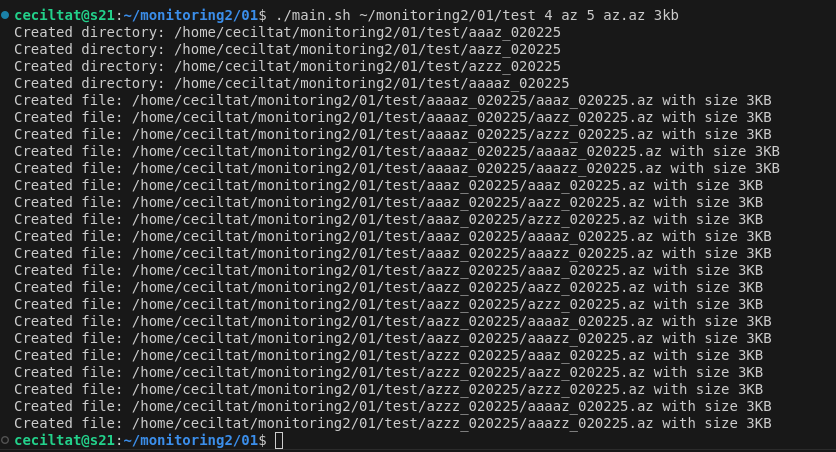  
  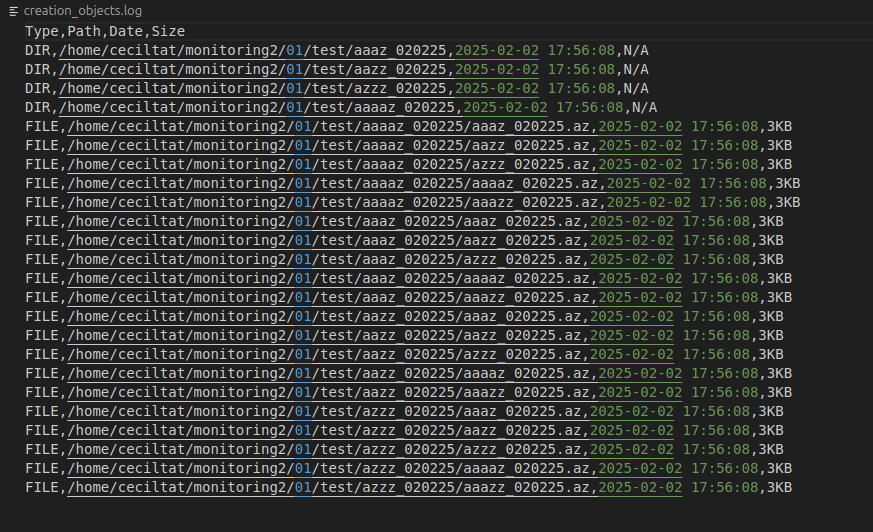  
  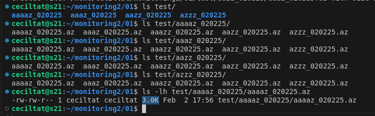  

## Part 2. Засорение файловой системы

**== Задание ==**

Напиши bash-скрипт. Скрипт запускается с 3 параметрами. Пример запуска скрипта: \
`main.sh az az.az 3Mb`

**Параметр 1** — список букв английского алфавита, используемый в названии папок (не более 7 знаков). \
**Параметр 2** — список букв английского алфавита, используемый в имени файла и расширении (не более 7 знаков для имени, не более 3 знаков для расширения). \
**Параметр 3** — размер файла (в Мегабайтах, но не более 100).  

Имена папок и файлов должны состоять только из букв, указанных в параметрах, и использовать каждую из них хотя бы 1 раз.  
Длина этой части имени должна быть от 5 знаков, плюс дата запуска скрипта в формате DDMMYY, отделённая нижним подчёркиванием, например: \
**./aaazz_021121/**, **./aaazzzz_021121** 

При этом если для имени папок или файлов были заданы символы `az`, то в названии файлов или папок не может быть обратной записи: \
**./zaaa_021121/**, т. е. порядок указанных в параметре символов должен сохраняться.

При запуске скрипта в различных (любых, кроме путей, содержащих **bin** или **sbin**) местах файловой системы должны быть созданы папки с файлами.
Количество вложенных папок — до 100. Количество файлов в каждой папке — случайное число (для каждой папки своё).  
Скрипт должен остановить работу, когда в файловой системе (в разделе /) останется 1 Гб свободного места.  
Свободное место в файловой системе определять командой: `df -h /`  

Запиши лог-файл с данными по всем созданным папкам и файлам (полный путь, дата создания, размер для файлов).  
В конце работы скрипта выведи на экран время начала работы скрипта, время окончания и общее время его работы. Дополни этими данными лог-файл.

**== Решение ==** 

- Скрипт лежит по пути src/02/ 
- Работа скрипта
  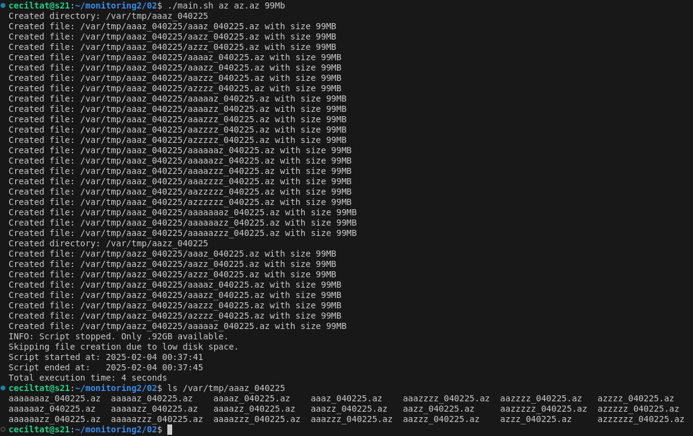   
  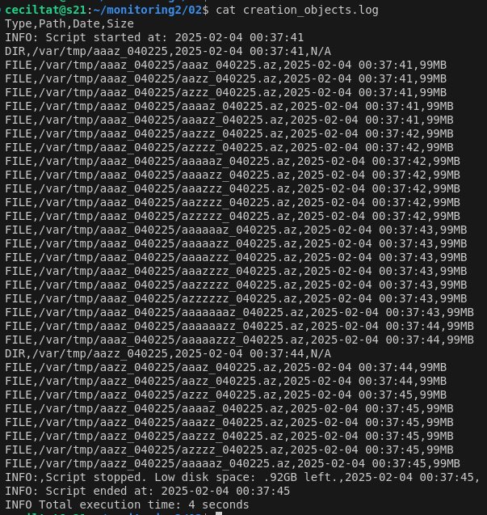  


## Part 3. Очистка файловой системы

**== Задание ==**

Напиши bash-скрипт. Скрипт запускается с 1 параметром.
Скрипт должен уметь очистить систему от созданных в [Part 2](#part-2-засорение-файловой-системы) папок и файлов 3 способами:

1. По лог файлу
2. По дате и времени создания
3. По маске имени (т. е. символы, нижнее подчёркивание и дата). 

Способ очистки задается при запуске скрипта, как параметр со значением 1, 2 или 3.

*При удалении по дате и времени создания пользователем вводятся времена начала и конца с точностью до минуты. Удаляются все файлы, созданные в указанном временном промежутке. Ввод может быть реализован как через параметры, так и во время выполнения программы.*

**== Решение ==**

- Скрипт лежит по пути src/03/

- По лог файлу  
  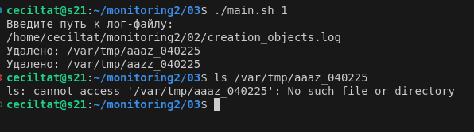  

- По дате и времени создания  
  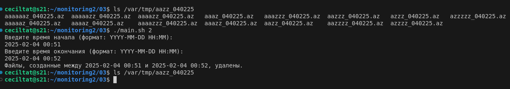  

- По маске имени  
  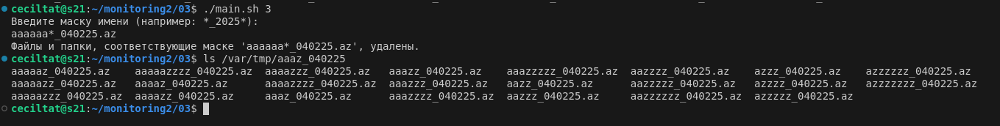  

## Part 4. Генератор логов

**== Задание ==**

Напиши bash-скрипт или программу на С, генерирующие 5 файлов логов **nginx** в *combined* формате.
Каждый лог должен содержать информацию за один день.

За день должно быть сгенерировано случайное число записей от 100 до 1000.
Для каждой записи должны случайным образом генерироваться:

1. IP (любые корректные, т. е. не должно быть ip вида 999.111.777.777)
2. Коды ответа (200, 201, 400, 401, 403, 404, 500, 501, 502, 503)
3. Методы (GET, POST, PUT, PATCH, DELETE)
4. Даты (в рамках заданного дня лога, должны идти по увеличению)
5. URL запроса агента
6. Агенты (Mozilla, Google Chrome, Opera, Safari, Internet Explorer, Microsoft Edge, Crawler and bot, Library and net tool)

В комментариях к своему скрипту/программе укажи, что означает каждый из использованных кодов ответа.

**== Решение ==**
- Скрипт лежит по пути src/04/
- 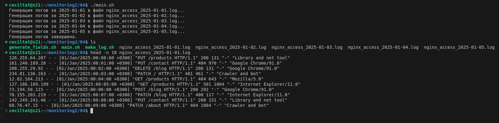  

## Part 5. Мониторинг

**== Задание ==**

Напиши bash-скрипт для разбора логов **nginx** из [Части 4](#part-4-генератор-логов) через **awk**.

Скрипт запускается с 1 параметром, который принимает значение 1, 2, 3 или 4.
В зависимости от значения параметра выведи:

1. Все записи, отсортированные по коду ответа;
2. Все уникальные IP, встречающиеся в записях;
3. Все запросы с ошибками (код ответа — 4хх или 5хх);
4. Все уникальные IP, которые встречаются среди ошибочных запросов.

**== Решение ==**
- Скрипт лежит по пути src/05/  
- Записи, отсортированные по коду ответа  
  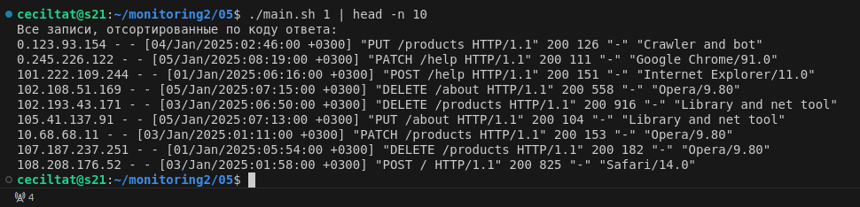  
- Все уникальные IP, встречающиеся в записях  
  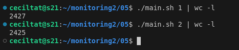  
- Все запросы с ошибками (код ответа — 4хх или 5хх)  
  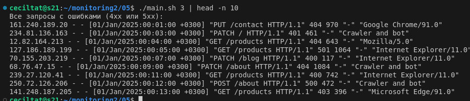  
- Все уникальные IP, которые встречаются среди ошибочных запросов  
  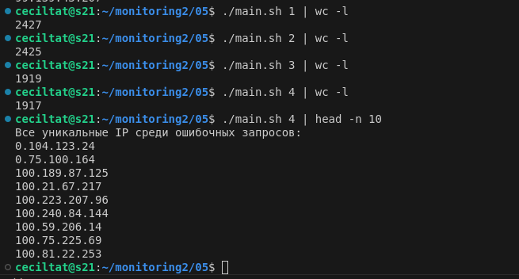  


## Part 6. **GoAccess**

Смотреть на результаты трудов в консоли, конечно, неплохо, но почему бы дополнительно не воспользоваться готовым решением, предоставляющим удобный интерфейс?

**== Задание ==**

С помощью утилиты GoAccess получи ту же информацию, что и в [Части 5](#part-5-мониторинг).

Открой веб-интерфейс утилиты на локальной машине.

**== Решение ==**
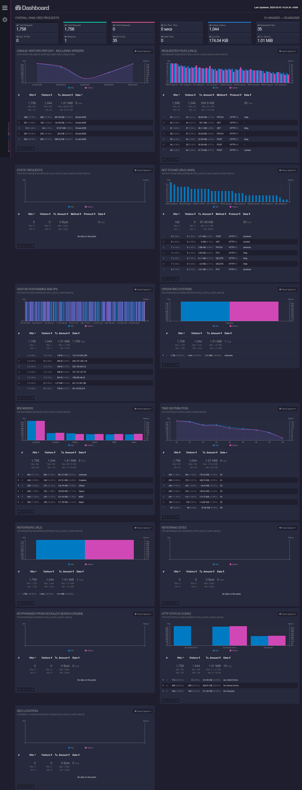


## Part 7. **Prometheus** и **Grafana**

**== Задание ==**

##### Установи и настрой **Prometheus** и **Grafana** на виртуальную машину.
##### Получи доступ к веб-интерфейсам **Prometheus** и **Grafana** с локальной машины.

##### Добавь на дашборд **Grafana** отображение ЦПУ, доступной оперативной памяти, свободное место и кол-во операций ввода/вывода на жестком диске.

##### Запусти свой bash-скрипт из [Части 2](#part-2-засорение-файловой-системы).
##### Посмотри на нагрузку жесткого диска (место на диске и операции чтения/записи).

##### Установи утилиту **stress** и запусти команду `stress -c 2 -i 1 -m 1 --vm-bytes 32M -t 10s`
##### Посмотри на нагрузку жесткого диска, оперативной памяти и ЦПУ.


**== Решение ==**

- stress -c 2 -i 1 -m 1 --vm-bytes 32M -t 10s  
  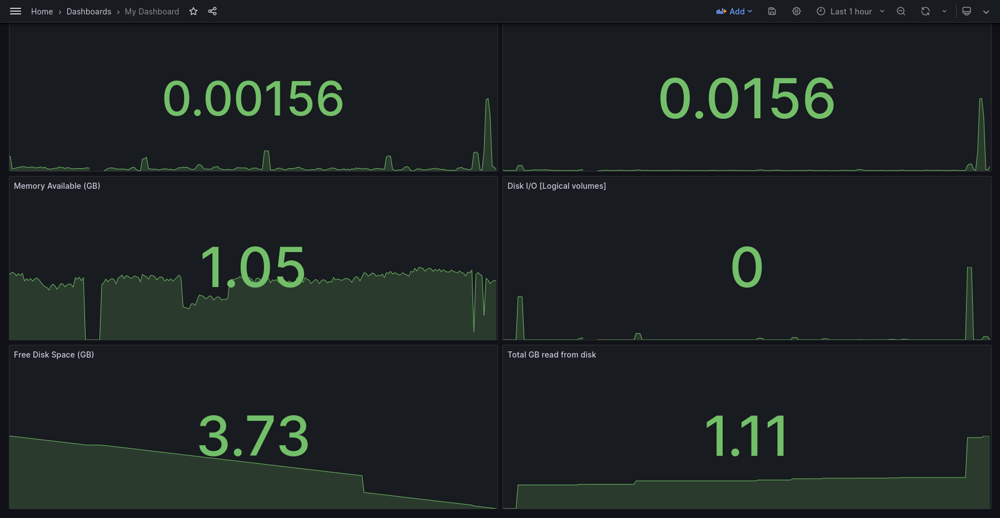   

- main\.sh az az\.az 99Mb  
  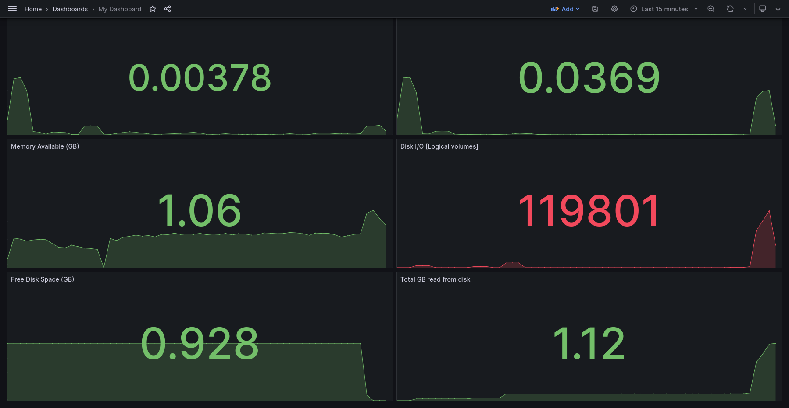


## Part 8. Готовый дашборд

Собственно, зачем составлять собственный дашборд, если, как говорится, «всё уже украдено до нас»?
Почему бы не взять готовый дашборд, на котором есть все нужные метрики?

**== Задание ==**

##### Установи готовый дашборд *Node Exporter Quickstart and Dashboard* с официального сайта **Grafana Labs**.

##### Проведи те же тесты, что и в [Части 7](#part-7-prometheus-и-grafana).

##### Запусти ещё одну виртуальную машину, находящуюся в одной сети с текущей.
##### Запусти тест нагрузки сети с помощью утилиты **iperf3**.

##### Посмотри на нагрузку сетевого интерфейса.

**== Решение ==**

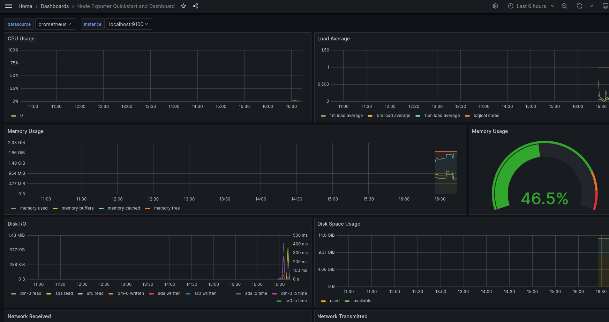  
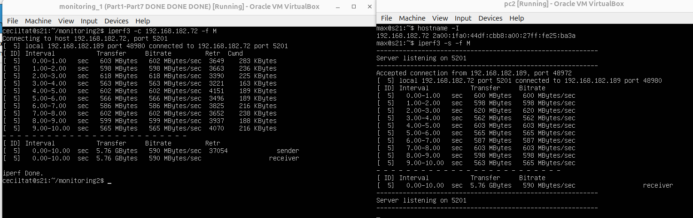  
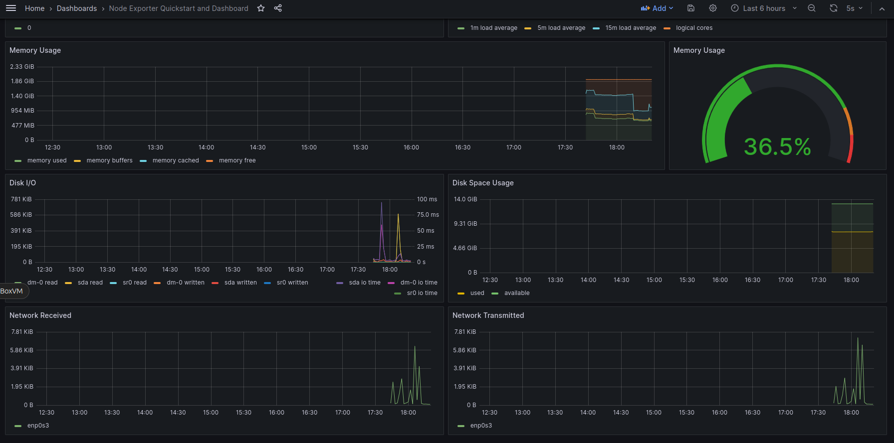  


## Part 9. Дополнительно. Свой *node_exporter*

Анализировать систему с помощью специальных утилит полезно и удобно, но тебе всегда хотелось понять, как же они работают.

**== Задание ==**

Напиши bash-скрипт или программу на С, собирающие информацию по базовым метрикам системы (ЦПУ, оперативная память, жесткий диск (объем)).
Скрипт или программа должна формировать html страничку по формату **Prometheus**, которую будет отдавать **nginx**. \
Саму страничку обновлять можно как внутри bash-скрипта или программы (в цикле), так и при помощи утилиты cron, но не чаще, чем раз в 3 секунды.

##### Поменяй конфигурационный файл **Prometheus**, чтобы он собирал информацию с созданной тобой странички.

##### Проведи те же тесты, что и в [Части 7](#part-7-prometheus-и-grafana).

**== Решение ==**
- Cкрипт
  ```bash
  #!/bin/bash

  METRICS_FILE="/home/ceciltat/monitoring2/09/metrics/index.html"

  collect_metrics() {
      CPU_USAGE=$(top -bn1 | grep "Cpu(s)" | sed "s/.*, *\([0-9.]*\)%* id.*/\1/" | awk '{print 100 - $1}')

      MEMORY_TOTAL=$(free -m | awk '/Mem:/ {print $2}')
      MEMORY_USED=$(free -m | awk '/Mem:/ {print $3}')
      MEMORY_AVAILABLE=$(free -m | awk '/Mem:/ {print $7}')

      DISK_TOTAL=$(df -k / | awk 'NR==2 {printf "%.1f", $2/1048576}')
      DISK_USED=$(df -k / | awk 'NR==2 {printf "%.1f", $3/1048576}')
      DISK_AVAILABLE=$(df -k / | awk 'NR==2 {printf "%.1f", $4/1048576}')

      cat <<EOF > $METRICS_FILE
  # HELP cpu_usage CPU usage in percent
  # TYPE cpu_usage gauge
  cpu_usage $CPU_USAGE

  # HELP memory_total Total memory in MB
  # TYPE memory_total gauge
  memory_total $MEMORY_TOTAL

  # HELP memory_used Used memory in MB
  # TYPE memory_used gauge
  memory_used $MEMORY_USED

  # HELP memory_available Available memory in MB
  # TYPE memory_available gauge
  memory_available $MEMORY_AVAILABLE

  # HELP disk_total Total disk space in GB
  # TYPE disk_total gauge
  disk_total $DISK_TOTAL

  # HELP disk_used Used disk space in GB
  # TYPE disk_used gauge
  disk_used $DISK_USED

  # HELP disk_available Available disk space in GB
  # TYPE disk_available gauge
  disk_available $DISK_AVAILABLE
  EOF
  }


  while true; do
      collect_metrics
      sleep 5  
  done
  ```

- Конфиг nginx
  ```nginx
  server {
    listen 80;
    server_name localhost 192.168.182.189;

    location /metrics {
        root /home/ceciltat/monitoring2/09;
        index index.html;
    }
  }
  ```
- Добавляем job в конфиг prometheus
  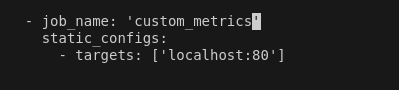
- Проверяем в веб-интерфейсе prometheus
  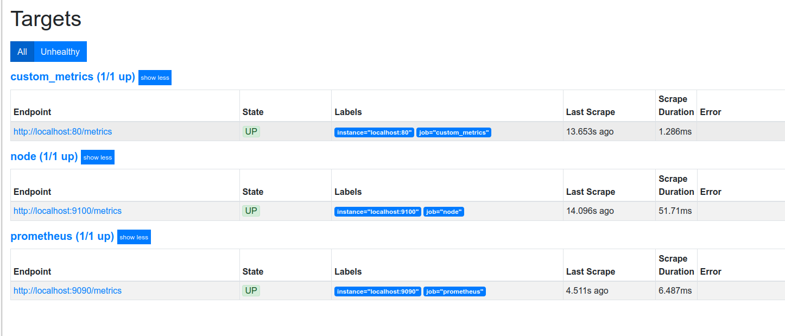
  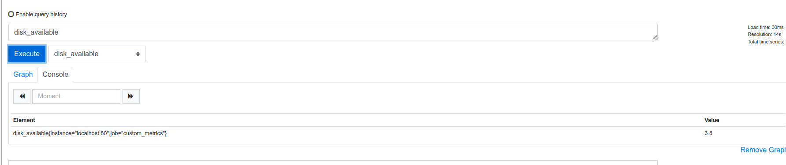
- Grafana c тестами
  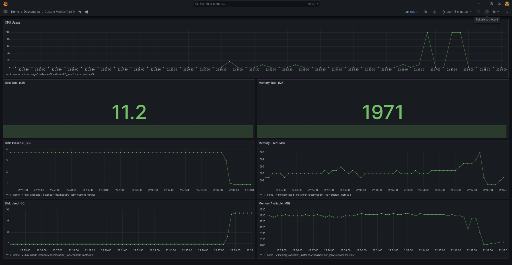

