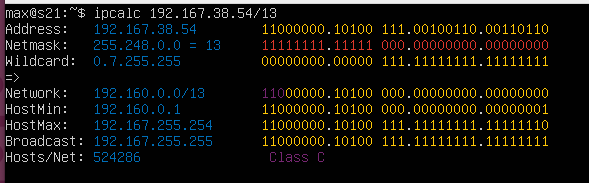
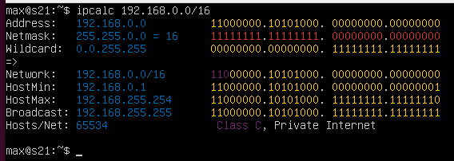
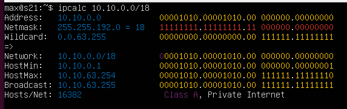
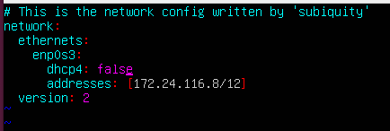
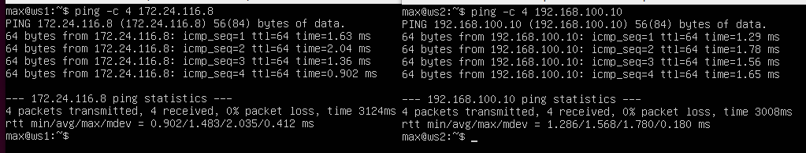
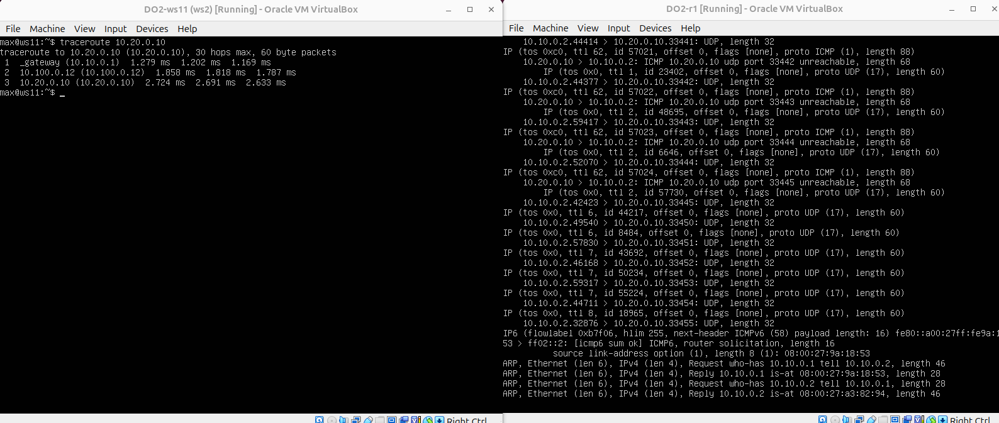

# Сети в Linux


## Part 1. Инструмент **ipcalc**

-  ##### Подними виртуальную машину (далее -- ws1)

- #### 1.1. Сети и маски
  ##### 1) Адрес сети *192.167.38.54/13*?
    
  Адрес сети: 192.160.0.0/13  
- ##### 2) Перевод маски *255.255.255.0* в префиксную и двоичную запись, */15* в обычную и двоичную
  ##### ipcalc 255.255.255.0
    
  Префиксная запись: /24   
  Двоичная запись: 11111111.11111111.11111111.00000000

  ##### ipcalc /15
    
  Обычная запись: 255.254.0.0  
  Двоичная запись: 11111111.11111110.00000000.00000000  


- ##### 3) Минимальный и максимальный хост в сети *12.167.38.4* при масках: */8*, *11111111.11111111.00000000.00000000*, *255.255.254.0* и */4*

  ##### ipcalc 12.167.38.4/8
     
  ХостМин: 12.0.0.1  
  ХостМакс: 12.255.255.254  

  ##### ipcalc 12.167.38.4/16
     
  ХостМин: 12.167.0.1  
  ХостМакс: 12.167.255.254  

  ##### ipcalc 12.167.38.4/23
    
  ХостМин: 12.167.38.1  
  ХостМакс: 12.167.39.254  

  ##### ipcalc 12.167.38.4/4
    
  ХостМин: 0.0.0.1  
  ХостМакс: 15.255.255.254    

- #### 1.2. localhost
  ##### Определи и запиши в отчёт, можно ли обратиться к приложению, работающему на localhost, со следующими IP: *194.34.23.100*, *127.0.0.2*, *127.1.0.1*, *128.0.0.1*
  - 127.0.0.2, 127.1.0.1 - можно т.к. подходят под маску 127.0.0.0/8  
  - 194.34.23.100, 128.0.0.1 - нельзя  

- #### 1.3. Диапазоны и сегменты сетей
  ##### Определи и запиши в отчёт:
  ##### 1) Какие из перечисленных IP можно использовать в качестве публичного, а какие только в качестве частных: *10.0.0.45*, *134.43.0.2*, *192.168.4.2*, *172.20.250.4*, *172.0.2.1*, *192.172.0.1*, *172.68.0.2*, *172.16.255.255*, *10.10.10.10*, *192.169.168.1*


  - Класс A: 10.0.0.0/8 (10.0.0.0 до 10.255.255.255)   
      
  - Класс B: 172.16.0.0/12 (172.16.0.0 до 172.31.255.255)   
      
  - Класс C: 192.168.0.0/16 (192.168.0.0 до 192.168.255.255)  
      

  _Следовательно_  

  Частные IP-адреса:  
  -  10.0.0.45  
  -  92.168.4.2  
  -  172.20.250.4  
  -  10.10.10.10  
  -  172.16.255.255  

  Публичные IP-адреса:  
  - 134.43.0.2  
  - 172.0.2.1  
  - 192.172.0.1  
  - 172.68.0.2  
  - 192.169.168.1  

  ##### 2) Какие из перечисленных IP-адресов шлюза возможны у сети *10.10.0.0/18*: *10.0.0.1*, *10.10.0.2*, *10.10.10.10*, *10.10.100.1*, *10.10.1.255*
  ##### ipcalc 10.10.0.0/18
    
  Возможны такие IP-адреса:
  - 10.10.0.2
  - 10.10.10.10
  - 10.10.1.255

## Part 2. Статическая маршрутизация между двумя машинами

- ##### Подними две виртуальные машины (далее -- ws1 и ws2).

  ##### С помощью команды `ip a` посмотри существующие сетевые интерфейсы.

  ##### Cетевый интерфейсы ws1
  
  ##### Сетевые интерфейсы ws2
  
- ##### Опиши сетевой интерфейс, соответствующий внутренней сети, на обеих машинах и задай следующие адреса и маски: ws1 — *192.168.100.10*, маска */16*, ws2 — *172.24.116.8*, маска */12*.
  ##### ws1 netplan
    
  Принимаем изменения  
  

  ##### ws2 netplan
    
  Принимаем изменения  
  

- #### 2.1. Добавление статического маршрута вручную
  ##### Добавь статический маршрут от одной машины до другой и обратно при помощи команды вида `ip r add`.
  ##### Пропингуй соединение между машинами.
  ##### ws1
  Добавление статического маршрута от ws1 до ws2  
  
  #### ws2
  Добавление статического маршрута от ws2 до ws1  
  

- #### 2.2. Добавление статического маршрута с сохранением
  ##### Перезапусти машины.
  ##### Добавь статический маршрут от одной машины до другой с помощью файла */etc/netplan/00-installer-config.yaml*.
  ##### Пропингуй соединение между машинами.

  ##### netplan для ws1 и ws2 со статическими маршрутами
    

  ##### ping
  

## Part 3. Утилита **iperf3**
- #### 3.1. Скорость соединения
  ##### Переведи и запиши в отчёт: 8 Mbps в MB/s, 100 MB/s в Kbps, 1 Gbps в Mbps.

  - 8 Mbps = 1 MB/s
  - 100 MB/s = 819200 Kbps
  - 1 Gbps = 1024 Mbps

- #### 3.2. Утилита **iperf3**
  ##### Измерь скорость соединения между ws1 и ws2.
  Запукаем iperf3 на хосте и клиенте  
     
  Ориентируемся на результаты, полученные на клиентской машине.  

## Part 4. Сетевой экран
- #### 4.1. Утилита **iptables**
  ##### Создай файл */etc/firewall.sh*, имитирующий файрвол, на ws1 и ws2

  ##### Нужно добавить в файл подряд следующие правила:
  ##### 1) На ws1 примени стратегию, когда в начале пишется запрещающее правило, а в конце пишется разрешающее правило (это касается пунктов 4 и 5).
  ##### 2) На ws2 примени стратегию, когда в начале пишется разрешающее правило, а в конце пишется запрещающее правило (это касается пунктов 4 и 5).
  ##### 3) Открой на машинах доступ для порта 22 (ssh) и порта 80 (http).
  ##### 4) Запрети *echo reply* (машина не должна «пинговаться», т. е. должна быть блокировка на OUTPUT).
  ##### 5) Разреши *echo reply* (машина должна «пинговаться»).
  ##### Запусти файлы на обеих машинах командами `chmod +x /etc/firewall.sh` и `/etc/firewall.sh`.

  #### ws1 - firewall
    
  

  #### ws2 - firewall
    
    
  В iptables обработка правил происходит сверху вниз и останавливается на первом подходящем правиле. Поэтому ws1 не может отвечать на пинг с ws2 (DROP), а ws2 может (ACCEPT).


- #### 4.2. Утилита **nmap**
  ##### Командой **ping** найди машину, которая не «пингуется», после чего утилитой **nmap** покажи, что хост машины запущен.
  ##### Проверяем, поднята ли машина с адресом 192.168.100.10
  

## Part 5. Статическая маршрутизация сети


- Сеть: \


- ##### Подними пять виртуальных машин (3 рабочие станции (ws11, ws21, ws22) и 2 роутера (r1, r2)).
- #### 5.1. Настройка адресов машин
  ##### Настрой конфигурации машин в *etc/netplan/00-installer-config.yaml* согласно сети на рисунке.

  #### Конфигурации
  ##### ws11
  
  ##### ws21 и ws22
  
  ##### r1 и r2
  
  ##### Перезапусти сервис сети. Если ошибок нет, командой `ip -4 a` проверь, что адрес машины задан верно. Также пропингуй ws22 с ws21. Аналогично пропингуй r1 с ws11.
  ##### ping ws22 с ws21, проверка адресов машин
  

  ##### ping r1 с ws11, проверка адресов машин
  

  ##### Адреса остальных машин:
  r1  
    
  r3  
    
  ws22   
    
  ##### Для включения переадресации IP выполни команду на роутерах:
  `sysctl -w net.ipv4.ip_forward=1`
  Включаем переадресацию на r1  
    
  Включаем переадресацию на r2  
    
  ##### Открой файл */etc/sysctl.conf* и добавь в него следующую строку:
  `net.ipv4.ip_forward = 1`

  ##### /etc/sysctl.conf на r1 c переадрисацией
  
  ##### /etc/sysctl.conf на r2 c переадрисацией
  
- #### 5.3. Установка маршрута по умолчанию
  Пример вывода команды `ip r` после добавления шлюза:
    ```
    default via 10.10.0.1 dev eth0
    10.10.0.0/18 dev eth0 proto kernel scope link src 10.10.0.2
    ```
    ##### Настрой маршрут по умолчанию (шлюз) для рабочих станций. Для этого добавь `default` перед IP-роутера в файле конфигураций. Вызови `ip r` и покажи, что добавился маршрут в таблицу маршрутизации.
    ##### ws11
      
    ##### ws21 и ws22
    

    ##### Пропингуй с ws11 роутер r2 и покажи на r2, что пинг доходит. Для этого используй команду:
    `tcpdump -tn -i eth0`
    ##### Проверка ping
      
    Пакеты доходят из Сети 1 в Сеть 2 благодаря "forward" на r1. А r2 не знает, как маршрутизировать входящий трафик, поэтому не приходит echo-reply на ws11.

-  #### 5.4. Добавление статических маршрутов
    ##### Добавь в роутеры r1 и r2 статические маршруты в файле конфигураций. Вызови `ip r` и покажи таблицы с маршрутами на обоих роутерах.
    ##### netplan для r1 и r2
    
    ##### "ip r" для r1 и r2
    

    #### Запустим команды на ws11:
    `ip r list 10.10.0.0/[маска сети]` и `ip r list 0.0.0.0/0`  
      
    Если в таблице маршрутизации есть несколько маршрутов, которые подходят для данного IP-адреса, маршрутизатор выбирает маршрут с самым длинным префиксом (наиболее специфичным). 

- #### 5.5. Построение списка маршрутизаторов

    ##### При помощи утилиты **traceroute** построй список маршрутизаторов на пути от ws11 до ws21.
    ##### Вызов tracerout на ws11 и tcpdump на ws21 (посмотреть как работает сам tracerout)
    
    По протоколу UDP (User Datagram Protocol – «протокол пользовательских датаграмм») Traceroute отправляет последовательность IP-пакетов. Всего таких пакетов по умолчанию может быть 3.  
    Первый пакет имеет время жизни (также известное как TTL (Time To Live) или лимит переходов), равное 1, второй пакет имеет TTL=2 и так далее.  
    Каждый раз, когда пакет передается новому маршрутизатору, TTL уменьшается на 1. Это сделано для предотвращения проблем с зацикливанием между серверами. Если бы не было TTL, пакет мог бы бесконечно долго перебрасываться между серверами.  
    Когда время жизни достигает 0, пакет отбрасывается, а маршрутизатор возвращает сообщение об ошибке. Отправляя пакеты таким образом, Traceroute гарантирует, что каждый маршрутизатор на пути отклонит пакет и отправит ответ.


- #### 5.6. Использование протокола **ICMP** при маршрутизации
    ##### Запусти на r1 перехват сетевого трафика, проходящего через eth0 с помощью команды:
    `tcpdump -n -i eth0 icmp`
    ##### Пропингуй с ws11 несуществующий IP (например, *10.30.0.111*) с помощью команды:
    `ping -c 1 10.30.0.111`
    ___
    ##### Пингуем несуществующий IP c ws11 и перхватываем трафик на r1
    

## Part 6. Динамическая настройка IP с помощью **DHCP**
- ##### Для r2 настрой в файле */etc/dhcp/dhcpd.conf* конфигурацию службы **DHCP**:
- ##### 1) Укажи адрес маршрутизатора по умолчанию, DNS-сервер и адрес внутренней сети.
- ##### 2) В файле *resolv.conf* пропиши `nameserver 8.8.8.8`.
___
- ##### dhcp.conf
  

- ##### resolv.conf
  ___Нужно редактировать файл, на который указывает символическая ссылка.___
  
  


- ##### Перезагрузи службу **DHCP** командой `systemctl restart     isc-dhcp-server`. Машину ws21 перезагрузи при помощи `reboot` и через `ip a` покажи, что она получила адрес. Также пропингуй ws22 с ws21.
  ##### ip a для ws21
  
  ##### ping ws22 from ws21
  

- ##### Укажи MAC-адрес у ws11, для этого в *etc/netplan/00-installer-config.yaml* надо добавить строки: `macaddress: 10:10:10:10:10:BA`, `dhcp4: true`.
    ##### ws11 netplan - добавлен MAC адрес
    
    ##### MAC address в VBox
    

- ##### Для r1 настрой аналогично r2, но сделай выдачу адресов с жесткой привязкой к MAC-адресу (ws11). Проведи аналогичные тесты.
  ##### dhcp.conf c привязкой выдачи адресов к MAC адресу ws11
  
  ##### ping ws11 from r1
  
  ##### resolv.conf - добавляем nameserver 8.8.8.8
  

- ##### Запроси с ws21 обновление IP-адреса.
  - В отчёте помести скрины IP до и после обновления.
  - Какими опциями **DHCP** сервера пользовался в данном пункте.  
  ##### Запрашиваем ip c помощью dhcp-client и проверяем полученный ip
      
    Опции DHCP сервера:
    - range 10.20.0.2 10.20.0.50; - диапазон IP, который может раздать сервер
    - option routers 10.20.0.1; - адрес шлюза по умолчанию
    - option domain-name-servers 10.20.0.1; - адрес DNS
    - hardware ethernet 10:10:10:10:10:BA; - MAC адрес сетевого интерфейса, для которого применяется статическое назначение IP (fixed address)
    - fixed-address 10.10.0.45; - статический IP-адрес сетевого интерфейса на основе его MAC-адреса

## Part 7. **NAT**
- ##### В файле */etc/apache2/ports.conf* на ws22 и r1 измени строку `Listen 80` на `Listen 0.0.0.0:80`, то есть сделай сервер Apache2 общедоступным. Запусти веб-сервер Apache командой `service apache2 start` на ws22 и r1.
    ##### ws22 - ports.conf
    
    ##### service apache2 start  
    
    ##### r1 - ports.conf
      
    ##### service apache2 start
    

- ##### Добавь в фаервол, созданный по аналогии с фаерволом из Части 4, на r2 следующие правила:
    ##### 1) Удаление правил в таблице filter — `iptables -F`;
    ##### 2) Удаление правил в таблице «NAT» — `iptables -F -t nat`;
    ##### 3) Отбрасывать все маршрутизируемые пакеты — `iptables --policy FORWARD DROP`.
    ##### Запусти файл также, как в Части 4.
    
    ##### Проверь соединение между ws22 и r1 командой `ping`.
      
    *При запуске файла с этими правилами, ws22 не должна «пинговаться» с r1.*  
    ##### Добавь в файл ещё одно правило:
    ##### 4) Разрешить маршрутизацию всех пакетов протокола **ICMP**.

    ##### Редактируем firewall, запускаем, пингуем ws22 и r1
    
    ##### 5) Включи **SNAT**, а именно маскирование всех локальных IPиз локальной сети, находящейся за r2 (по обозначениям из Части 5 — сеть 10.20.0.0).
    ##### 6) Включи **DNAT** на 8080 порт машины r2 и добавить к веб-серверу Apache, запущенному на ws22, доступ извне сети.
    
    ##### Проверь соединение по TCP для **SNAT**: для этого с ws22 подключиться к серверу Apache на r1 командой:
    `telnet [адрес] [порт]`  
    
    ##### Проверь соединение по TCP для **DNAT**: для этого с r1 подключиться к серверу Apache на ws22 командой `telnet` (обращаться по адресу r2 и порту 8080).  
    


## Part 8. Дополнительно. Знакомство с **SSH Tunnels**
- ##### Запускаем firwall из Части 7
    

- ##### Запускаеи веб-сервер **Apache** на ws22 только на localhost (то есть в файле */etc/apache2/ports.conf* изменяем строку `Listen 80` на `Listen localhost:80`).
    
- ##### Воспользуемся *Local TCP forwarding* с ws21 до ws22, чтобы получить доступ к веб-серверу на ws22 с ws21
    
- ##### Воспользуемся *Remote TCP forwarding* c ws11 до ws22, чтобы получить доступ к веб-серверу на ws22 с ws11
  
- ##### Для проверки, сработало ли подключение в обоих предыдущих пунктах, перейдем во второй терминал (например, клавишами Alt + F2) и выполним команду:
  `telnet 127.0.0.1 [локальный порт]`  
  ##### Проверяем Local TCP forwarding с ws21 до ws22  
    

  ##### Проверяем Local TCO forwarding c ws11 до ws22
  
